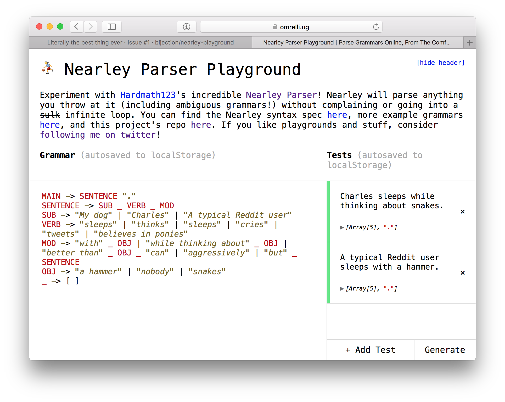

[nearley](http://nearley.js.org) [](http://js.org)
==============

Simple parsing for node.js.

<!-- $ npm install -g doctoc -->
<!-- $ doctoc --notitle README.md -->
<!-- START doctoc generated TOC please keep comment here to allow auto update -->
<!-- DON'T EDIT THIS SECTION, INSTEAD RE-RUN doctoc TO UPDATE -->


- [What is nearley?](#what-is-nearley)
- [Why do I care?](#why-do-i-care)
- [Installation and Usage](#installation-and-usage)
- [Parser specification](#parser-specification)
  - [Postprocessors](#postprocessors)
  - [Epsilon rules](#epsilon-rules)
  - [Charsets](#charsets)
  - [EBNF](#ebnf)
  - [Macros](#macros)
  - [Additional JS](#additional-js)
  - [Importing](#importing)
  - [Custom tokens](#custom-tokens)
- [Using a parser](#using-a-parser)
- [Catching errors](#catching-errors)
- [Exploring a parser interactively](#exploring-a-parser-interactively)
- [The Unparser](#the-unparser)
- [Automagical Railroad Diagrams](#automagical-railroad-diagrams)
- [Other Tools](#other-tools)
- [Still confused?](#still-confused)
- [Contributing](#contributing)
- [Further reading](#further-reading)

<!-- END doctoc generated TOC please keep comment here to allow auto update -->

What is nearley?
----------------
nearley uses the Earley parsing algorithm augmented with Joop Leo's
optimizations to parse complex data structures easily. nearley is über-fast and
really powerful. It can parse literally anything you throw at it.

nearley is used by [artificial
intelligence](https://github.com/ChalmersGU-AI-course/shrdlite-course-project)
and [computational
linguistics](https://wiki.eecs.yorku.ca/course_archive/2014-15/W/6339/useful_handouts)
classes at universities, as well as [file format
parsers](https://github.com/raymond-h/node-dmi), [markup
languages](https://github.com/bobbybee/uPresent) and [complete programming
languages](https://github.com/bobbybee/carbon). It's an npm [staff
pick](https://www.npmjs.com/package/npm-collection-staff-picks).

Why do I care?
--------------

nearley can parse what other JS parse engines cannot, because it uses a
different algorithm. The Earley algorithm is *general*, which means it can
handle *any* grammar you can define in BNF. In fact, the nearley syntax is
written in *itself* (this is called bootstrapping).

PEGjs and Jison are recursive-descent based, and so they will choke on a lot of
grammars, in particular [left recursive
ones](http://en.wikipedia.org/wiki/Left_recursion).

nearley also has capabilities to catch errors gracefully, and detect ambiguous
grammars (grammars that can be parsed in multiple ways).

Installation and Usage
----------------------

> **Note:** For beginners, Guillermo Webster's
> [nearley-playground](https://omrelli.ug/nearley-playground/) is a wonderful
> way to explore nearley interactively in your browser:
>
> 
> 
> Enjoy!

To use nearley, you need both a *global* and a *local* installation. The two
types of installations are described separately below.

---

To *compile* a nearley parser (a `.ne` file), you need to install the
`nearleyc` command from npm:

    $ npm install -g nearley
    $ nearleyc parser.ne

nearley ships with three additional tools:
- `nearley-test` lets you quickly test a grammar against some input and see the
  results. It also lets you explore the internal state of nearley's Earley
  table, in case you find that interesting.
- `nearley-unparse` inverts a parser into a generator, allowing you to create
  random strings that match your grammar.
- `nearley-railroad` generates pretty railroad diagrams from your parser. This
  is mainly helpful for creating documentation, as (for example) on json.org.

You can uninstall the nearley compiler using `npm uninstall -g nearley`.

---

To *use* a generated grammar, you need to install `nearley` as a per-project
dependency via npm (note that there is no `-g` in the first command):

```
$ npm install nearley
$ node
> var nearley = require("nearley");
> var grammar = require("./my-generated-grammar.js");
```

Alternatively, to use a generated grammar in a browser runtime, include the
`nearley.js` file in a `<script>` tag.

```html
<script src="nearley.js"></script>
<script src="my-generated-grammar.js"></script>
```


Parser specification
--------------------

This is a basic overview of nearley syntax and usage. For an advanced
styleguide, see [this file](how-to-grammar-good.md).

A parser consists of several *nonterminals*, which are constructions in a
language. A nonterminal is made up of a series of either other nonterminals or
strings. In nearley, you define a nonterminal by giving its name and its
expansions.

Strings are the *terminals*, which match those string literals (specified as
JSON-compatible strings).

The following grammar matches a number, a plus sign, and another number:

    expression -> number "+" number
    
Anything from a `#` to the end of a line is ignored as a comment:

    expression -> number "+" number # sum of two numbers

A nonterminal can have multiple expansions, separated by vertical bars (`|`):

    expression ->
          number "+" number
        | number "-" number
        | number "*" number
        | number "/" number

The parser tries to parse the first nonterminal that you define in a file.
However, you can (and should!) introduce more nonterminals as "helpers". In
this example, we would have to define the expansion of `number`.


### Postprocessors

Each meaning (called a *production rule*) can have a postprocessing function,
that can format the data in a way that you would like:

```js
expression -> number "+" number 
```

`data` is an array whose elements match the nonterminals in order. The
postprocessor `id` returns the first token in the match (literally
`function(data) {return data[0];}`).

`location` is the index at which that rule was found. Retaining this
information in a syntax tree is useful if you're writing an interpreter and
want to give fancy error messages for runtime errors.

If, after examining the data, you want to force the rule to fail anyway, return
`reject`. An example of this is allowing a variable name to be a word that is
not a string:

```js
variable -> word 
```

You can write your postprocessors in CoffeeScript by adding `@preprocessor
coffee` to the top of your file. Similarly, you can write them in TypeScript by
adding `@preprocessor typescript` to the top of your file. If you would like to
support a different postprocessor language, feel free to file a PR!

### Epsilon rules

The **epsilon rule** is the empty rule that matches nothing. The constant
`null` is the epsilon rule, so:

    a -> null
        | a "cow"

will match 0 or more `cow`s in a row.

### Charsets

You can use valid RegExp charsets in a rule:

    not_a_letter -> [^a-zA-Z]

The `.` character can be used to represent "any character".

### EBNF

nearley compiles some higher-level constructs into BNF for you. In particular,
the `*`, `?`, and `+` operators from Regexes (or EBNF) are available as shown:

    batman -> "na":* "batman" # nananana...nanabatman

You can also use capture groups with parentheses. Its contents can be anything
that a rule can have:

    banana -> "ba" ("na"  | "NA" ):+

### Macros

You can create "polymorphic" rules through macros:

    match3[X] -> $X $X $X
    quote[X]  -> "'" $X "'"

    main -> match3[quote["Hello?"]]
    # matches "'Hello?''Hello?''Hello?'"

Macros are dynamically scoped:

    foo[X, Y] -> bar[("moo" | "oink" | "baa")] $Y
    bar[Z]    -> $X " " $Z # 'remembers' $X from its caller
    main -> foo["Cows", "."]
    # matches "Cows oink." and "Cows moo."

Macros *cannot* be recursive (`nearleyc` will go into an infinite loop trying
to expand the macro-loop).

### Additional JS

For more intricate postprocessors, or any other functionality you may need, you
can include parts of literal JavaScript between production rules by surrounding
it with `@`:

```js
@
cow -> "moo" 
```

Note that it doesn't matter where you define these; they all get hoisted to the
top of the generated code.

### Importing

You can include the content of other parser files:

    @include "../misc/primitives.ne" # path relative to file being compiled
    sum -> number "+" number

There are also some built-in parsers whose contents you can include:

    @builtin "cow.ne"
    main -> cow:+

See the `builtin/` directory for an index of this library. Contributions are
welcome here!

Including a parser imports *all* of the nonterminals defined in the parser, as
well as any JS, macros, and config options defined there.


### Custom lexers

You can pass a `lexer` instance to Parser, which must have the following interface:

* `reset(chunk, Info)`: set the internal buffer to `chunk`, and restore line/col/state info taken from `save()`.
* `next() -> Token` return e.g. `{type, value, line, col, …}`. Only the `value` attribute is required.
* `save() -> Info` -> return an object describing the current line/col etc. This allows us to preserve this information between `feed()` calls, and also to support `Parser#rewind()`. The exact structure is lexer-specific; nearley doesn't care what's in it.
* `formatError(token)` -> return a string with an error message describing the line/col of the offending token. You might like to include a preview of the line in question.
* `has(tokenType)` -> return true if the lexer can emit tokens with that name. Used to resolve `%`-specifiers in compiled nearley grammars.

If Parser isn't given a lexer option, it will look for a `.lexer` attribute on its Grammar. The `@lexer` directive allows exporting a lexer object from your `.ne` grammar file. (See `json.ne` for an example.)


### Custom tokens

Nearley assumes by default that your fundamental unit of parsing, called a
*token*, is a character. That is, you're parsing a list of characters. However,
sometimes you want to preprocess your string to turn it into a list of *lexical
tokens*. This means, instead of seeing "1", "2", "3", the nearley might just
see a single list item "123". This is called *tokenizing*, and it can bring you
decent performance gains. It also allows you to write cleaner, more
maintainable grammars and to prevent ambiguous grammars.

Tokens can be defined in two ways: literal tokens and testable tokens. A
literal token matches exactly, while a testable token runs a function to test
whether it is a match or not.

```
@

main -> %print_tok %number_tok
```

Now, instead of parsing the string `"print 12"`, you would parse the array
`["print", 12]`.

You can write your own tokenizer using regular expressions, or choose from
several existing tokenizing libraries for node.


Using a parser
--------------

nearley exposes the following API:

```js
var grammar = require("generated-code.js");
var nearley = require("nearley");

// Create a Parser object from our grammar.
var p = new nearley.Parser(grammar.ParserRules, grammar.ParserStart);

// Parse something
p.feed("1+1");
// p.results --> [ ["sum", "1", "1"] ]
```

The `Parser` object can be fed data in parts with `.feed(data)`. You can then
find an array of parsings with the `.results` property. If `results` is empty,
then there are no parsings. If `results` contains multiple values, then that
combination is ambiguous.

The incremental feeding design is inspired so that you can parse data from
stream-like inputs, or even dynamic readline inputs. For example, to create a
Python-style REPL where it continues to prompt you until you have entered a
complete block.

```js
p.feed(prompt_user(">>> "));
while (p.results.length < 1) {
    p.feed(prompt_user("... "));
}
console.log(p.results);
```

The `nearley.Parser` constructor takes an optional third parameter, `options`,
which is an object with the following possible keys:

- `keepHistory` (boolean, default `false`): if set to `true`, nearley will
  preserve the internal state of the parser in the parser's `.table` property.
  Preserving the state has some performance cost (because it can potentially be
  very large), so we recommend leaving this as `false` unless you are familiar
  with the Earley parsing algorithm and are planning to do something exciting
  with the parse table.

Catching errors
---------------

If there are no possible parsings, nearley will throw an error whose `offset`
property is the index of the offending token.

```js
try {
    p.feed("1+gorgonzola");
} catch(parseError) {
    console.log(
        "Error at character " + parseError.offset
    ); // "Error at character 2"
}
```


Exploring a parser interactively
--------------------------------

The global install will provide `nearley-test`, a simple command-line tool you
can use to inspect what a parser is doing. You input a generated `grammar.js`
file, and then give it some input to test the parser against. `nearley-test`
prints out the output if successful, and also gives you the complete parse
table used by the algorithm. This is very helpful when you're testing a new
parser.

This was previously called `bin/nearleythere.js` and written by Robin.


The Unparser
------------

The Unparser takes a (compiled) parser and outputs a random string that would
be accepted by the parser.

```
$ nearley-unparse -s number <(nearleyc builtin/prims.ne)
-6.22E94
```

You can use the Unparser to...

- ...test your parser specification by generating lots of random expressions
and making sure all of them are "correct".
- ...generate random strings from a schema (for example, random email addresses
or telephone numbers).
- ...create fuzzers and combinatorial stress-testers.
- ...play "Mad-Libs" automatically! (Practical application: automatic
grammatically valid loremtext.)

The Unparser outputs as a stream by continuously writing characters to its
output pipe. So, if it "goes off the deep end" and generates a huge string, you
will still see output scrolling by in real-time.

To limit the size of the output, you can specify a bound on the depth with the
`-d` flag. This switches the Unparser to a different algorithm. A larger depth
bound corresponds to larger generated strings.

As far as I know, nearley is the only parser generator with this feature. It
is inspired by Roly Fentanes' [randexp](https://fent.github.io/randexp.js/),
which does the same thing with regular expressions.


Automagical Railroad Diagrams
-----------------------------

nearley lets you convert your grammars to pretty SVG railroad diagrams that you
can include in webpages, documentation, and even papers.

```
$ nearley-railroad regex.ne -o grammar.html
```


See a bigger example [here](http://nearley.js.org/www/railroad-demo.html).

(This feature is powered by
[`railroad-diagrams`](https://github.com/tabatkins/railroad-diagrams) by
tabatkins.)


Other Tools
-----------

*This section lists nearley tooling created by other developers. These tools
are not distributed with nearley, so if you have problems, please contact the
respective author for support instead of opening an issue with nearley.*

Atom users can write nearley grammars with [this
plugin](https://github.com/bojidar-bg/nearley-grammar) by Bojidar Marinov.

Sublime Text users can write nearley grammars with [this
syntax](https://github.com/liam4/nearley-syntax-sublime) by liam4.

Vim users can use [this plugin](https://github.com/andres-arana/vim-nearley) by
Andrés Arana.

Visual Studio Code users can use [this
extension](https://github.com/karyfoundation/nearley-vscode) by Pouya Kary.

Python users can convert nearley grammars to Python using
[lark](https://github.com/erezsh/lark#how-to-use-nearley-grammars-in-lark) by
Erez.

Browser users can use
[nearley-playground](https://omrelli.ug/nearley-playground/) by Guillermo
Webster to explore nearley interactively in the browser. There is also a [Mac
app](https://github.com/pmkary/nearley-playground-mac) by Pouya Kary.

Webpack users can use
[nearley-loader](https://github.com/kozily/nearley-loader) by Andrés Arana to
load grammars directly.


Still confused?
---------------
You can read [the calculator example](examples/calculator/arithmetic.ne) to get
a feel for the syntax (see it live
[here](http://hardmath123.github.io/nearley/examples/calculator/)). You can
read a grammar for [tosh](https://tosh.tjvr.org) over [here](examples/tosh.ne).
There are more sample grammars in the `/examples` directory. For larger
examples, we also have experimental parsers for **CSV** and **Lua**.


Contributing
------------

Clone, hack, PR. Tests live in `test/` and can be called with `npm test`. Make
sure you read `test/profile.log` after tests run, and that nothing has died
(parsing is tricky, and small changes can kill efficiency).

If you're looking for something to do, here's a short list of things that would
make me happy:

- Optimize. There are still plenty of optimizations that an enterprising
  JS-savant could implement.
- Help build the builtins library by PRing in your favorite primitives.
- Solutions to issues labeled "up for grabs" on the issue tracker.

Nearley is MIT licensed.

A big thanks to Nathan Dinsmore for teaching me how to Earley, Aria Stewart for
helping structure nearley into a mature module, and Robin Windels for
bootstrapping the grammar. Additionally, Jacob Edelman wrote an experimental
JavaScript parser with nearley and contributed ideas for EBNF support. Joshua
T. Corbin refactored the compiler to be much, much prettier. Bojidar Marinov
implemented postprocessors-in-other-languages. Shachar Itzhaky fixed a subtle
bug with nullables.


Further reading
---------------

- Read my [blog post](http://hardmath123.github.io/earley.html) to learn more
  about the algorithm. 
- Read about [Marpa](http://savage.net.au/Marpa.html) to
  learn more than you ever thought you wanted to know about parsing.
- A [nearley
  tutorial](https://medium.com/@gajus/parsing-absolutely-anything-in-javascript-using-earley-algorithm-886edcc31e5e)
  written by @gajus.

